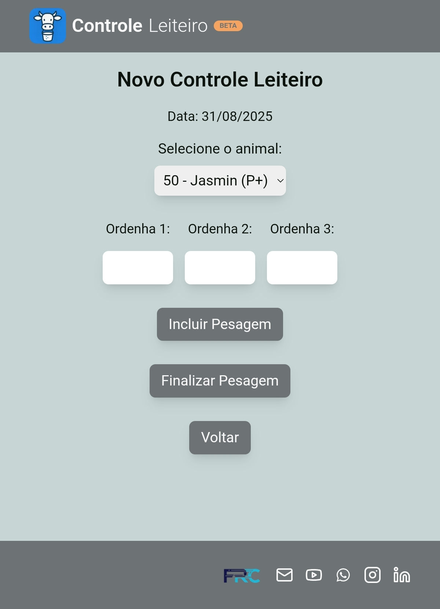
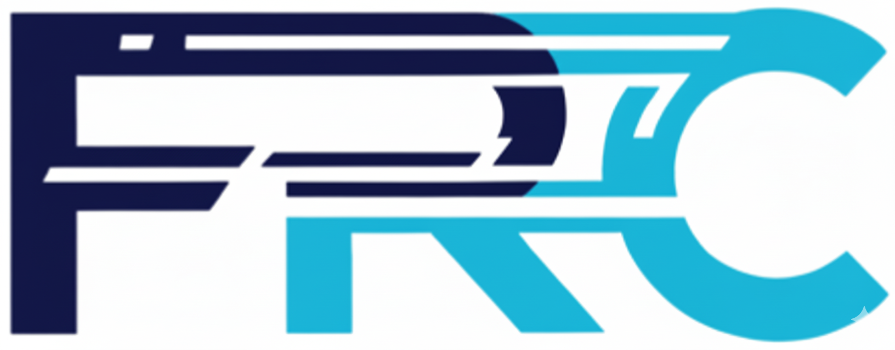

# App Controle Leiteiro - Frontend

> Interface moderna e responsiva para o gerenciamento de produção leiteira, construída com Next.js e Tailwind CSS para oferecer uma experiência de usuário ágil e intuitiva.

  
  
  
  

  

## 📋 Índice

- [Status do Projeto](#-status-do-projeto)
- [Sobre o Projeto](#-sobre-o-projeto)
- [Funcionalidades](#-funcionalidades)
- [Técnicas e Conceitos Aplicados](#-técnicas-e-conceitos-aplicados)
- [Tecnologias Utilizadas](#-tecnologias-utilizadas)
- [Como Executar o Projeto](#-como-executar-o-projeto)
- [Autor](#-autor)
- [Licença](#-licença)

## 🚧 Status do Projeto

O projeto encontra-se em fase de desenvolvimento ativo, com a maior parte do design e das funcionalidades essenciais já implementadas.

#### Funcionalidades Concluídas:
- ✅ Design Mobile-First para todas as telas principais (Login, Fazenda, Atividades, Cadastro de Animais, Controle Leiteiro e Relatórios).
- ✅ Layout totalmente responsivo, garantindo usabilidade em desktops e dispositivos móveis.
- ✅ Implementação dos estados de `:hover` e `:focus` para todos os elementos interativos, melhorando a acessibilidade e a experiência do usuário.

#### Próximos Passos:
- ⏳ Monetização
- ⏳ Desenvolvimento da funcionalidade de exportação para PDF/Impressão.
- ⏳ Criação de uma tela de relatórios avançados com mais filtros e visualizações.
- ⏳ Implementação de relatório gerado por Inteligência Artificial.
- ⏳ Refatoração contínua do código para otimização de performance e manutenibilidade.

## 📖 Sobre o Projeto

O **App Controle Leiteiro** é uma aplicação front-end desenvolvida para simplificar a vida de produtores rurais e técnicos agropecuários. O objetivo é substituir anotações manuais em papel por uma ferramenta digital, rápida e confiável para a pesagem de leite durante a ordenha.

A interface foi construída para ser clara e objetiva, permitindo que usuários com diferentes níveis de familiaridade com tecnologia possam cadastrar seus animais, registrar a produção diária e extrair relatórios simples para tomada de decisão.

## ✨ Funcionalidades

- 👁️ **Layout Responsivo:** A interface se adapta perfeitamente ao tamanho da tela, seja em um celular no campo ou em um computador no escritório.
- 🖱️ **Estados Interativos:** Todos os botões, links e inputs possuem estados de foco e hover claros para uma melhor usabilidade.
- 👤 **Autenticação:** O usuário pode se cadastrar e realizar login para acessar seus dados de forma segura.
- 🏡 **Gestão de Propriedades:** Cadastro e identificação da Fazenda ou Retiro onde a pesagem está sendo realizada.
- 📝 **Cadastro de Animais:** Formulário completo para registrar animais com número, nome, data do parto e previsão do próximo parto.
- 🥛 **Registro de Produção:** Interface otimizada para lançar rapidamente a produção individual de cada animal na data da pesagem.
- 📊 **Relatórios Simplificados:** Geração de listas de produção ordenadas por volume, com cálculo automático de médias.

## 💡 Técnicas e Conceitos Aplicados

Este projeto foi cuidadosamente construído com um stack moderno, focando em performance, escalabilidade e uma excelente experiência de desenvolvimento.

#### 🚀 Arquitetura e Roteamento com Next.js App Router
A aplicação utiliza a arquitetura **App Router** do Next.js 14, aproveitando seus recursos mais recentes para criar uma experiência web rápida e robusta.
- **Server Components:** Grande parte da UI é renderizada no servidor, reduzindo a quantidade de JavaScript enviado ao cliente e melhorando o tempo de carregamento inicial.
- **Roteamento Baseado em Arquivos:** A estrutura de pastas define as rotas da aplicação, incluindo suporte para layouts aninhados (`layout.tsx`).
- **Navegação no Cliente:** A navegação entre páginas é gerenciada pelo hook `useRouter` do `next/navigation`, otimizado para o App Router, garantindo transições rápidas e suaves.

#### 🔄 Busca de Dados Reativa com SWR
O gerenciamento de dados remotos (data fetching) é feito com a biblioteca **SWR (Stale-While-Revalidate)**, uma estratégia poderosa que garante que a UI esteja sempre rápida e atualizada.
- **Cache Inteligente:** O SWR primeiro retorna dados do cache (stale) para uma renderização instantânea, e depois busca os dados mais recentes em segundo plano (revalidate).
- **Revalidação Automática:** Os dados são atualizados automaticamente quando o usuário foca na janela ou se reconecta à internet, mantendo a aplicação sincronizada sem intervenção manual.
- **Mutações Otimistas:** A função `mutate` do SWR é utilizada para atualizar localmente os dados na interface do usuário após uma ação (como cadastrar um animal), proporcionando um feedback instantâneo antes mesmo da confirmação do servidor.
- **Cliente HTTP com Axios:** Todas as requisições à API são realizadas através do **Axios**, um cliente HTTP robusto e fácil de usar.

#### ⚡️ Performance e Experiência do Usuário (UX)
- **Progressive Web App (PWA):** A aplicação é um PWA completo, o que significa que pode ser "instalada" na tela inicial de dispositivos móveis e desktops, além de oferecer funcionalidades offline básicas para uma experiência mais resiliente e similar a um aplicativo nativo.
- **Loading UI com React Suspense:** O `Suspense` é usado para criar estados de carregamento granulares. Isso permite que partes da interface sejam renderizadas enquanto outras ainda estão buscando dados, melhorando a percepção de velocidade e evitando telas em branco.
- **Otimização de Imagens:** Com a biblioteca `sharp` integrada ao build do Next.js, as imagens são otimizadas automaticamente, garantindo que sejam servidas nos melhores formatos (como WebP) e tamanhos adequados, reduzindo o tempo de carregamento das páginas.

#### 🔐 Autenticação e Gerenciamento de Sessão
A autenticação é baseada em tokens (JWT) e implementada inteiramente no lado do cliente após o login.
- **Fluxo de Token:** Após o login bem-sucedido, o token JWT e o `farmerId` recebidos da API são armazenados no `localStorage` do navegador.
- **Persistência de Sessão:** O uso do `localStorage` garante que o usuário permaneça logado mesmo após fechar ou recarregar a página.
- **Tratamento de Erros:** A lógica de login é encapsulada em um bloco `try/catch`, fornecendo feedback claro ao usuário em caso de falha na autenticação.

#### 🧩 Gerenciamento de Estado Local e Hooks Avançados
O estado dos componentes é gerenciado com uma combinação de Hooks do React para otimização e controle preciso.
- **Hooks Essenciais:** `useState` para o estado reativo, `useEffect` para efeitos colaterais e `useRef` para referências.
- **Otimização de Performance:** O `useCallback` é utilizado para memoizar funções, evitando re-renderizações desnecessárias de componentes filhos e otimizando a performance geral da aplicação.

#### 🛠️ Qualidade de Código com TypeScript
Todo o projeto é desenvolvido em **TypeScript**. Isso garante a tipagem estática dos dados, desde as respostas da API até os adereços dos componentes, o que resulta em um código mais seguro, com menos bugs em tempo de execução e uma experiência de desenvolvimento muito superior com autocomplete e autovalidação.

## 💻 Tecnologias Utilizadas

| Tecnologia | Descrição |
| :--- | :--- |
| **Next.js** | Framework React para produção, utilizado para estruturar a aplicação, gerenciar rotas e otimizar o build. |
| **React** | Biblioteca base para a construção de toda a interface de usuário componentizada. |
| **Tailwind CSS** | Framework de estilização CSS utility-first para a criação rápida de layouts responsivos e customizados. |
| **Node.js** | Ambiente de execução para o servidor de desenvolvimento e build do Next.js. |

## 👨‍💻 Autor

**Fernando R Costa**

  
  
  

## 📄 Licença
Este projeto está sob uma licença Proprietária. A visualização do código é permitida exclusivamente para fins de portfólio e demonstração de habilidades.

Consulte o arquivo LICENSE para mais detalhes.